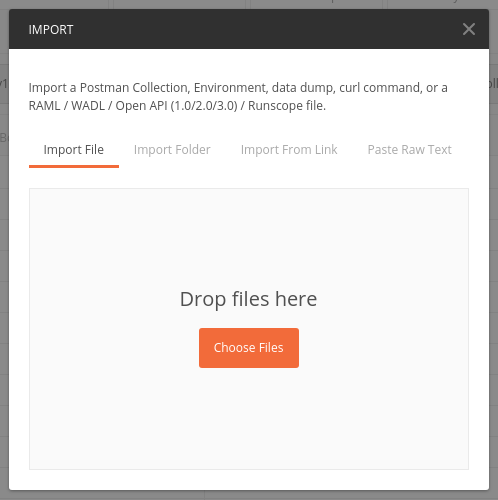
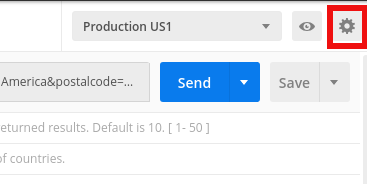
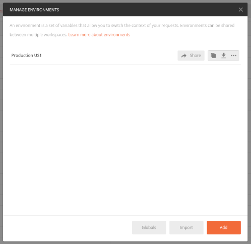
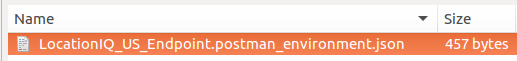
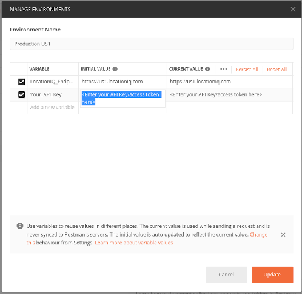

# API Collection

We recommend using REST clients like <a href="https://www.postman.com" target="_blank">Postman</a> to test our APIs. Please click on the link below to download the Postman collection with pre-made examples and get started.

### Load Collection

1. Download the provided  
    - <a href="https://raw.githubusercontent.com/location-iq/postman-collection/master/LocationIQ_Collection_v2.0.0.postman_collection.json" target="_blank">LocationIQ Collection</a> file (`Right-Click -> Save As`). 
       
2. Open Postman and click `Import` and choose the LocationIQ Collection file that was downloaded from the link above.    

### Load Environment

1. Download the environment file depending on the endpoint you want to use.
    - <a href="https://raw.githubusercontent.com/location-iq/postman-collection/master/environments/LocationIQ_EU_Endpoint.postman_environment.json" target="_blank">EU endpoint Environment File</a>
    - <a href="https://raw.githubusercontent.com/location-iq/postman-collection/master/environments/LocationIQ_US_Endpoint.postman_environment.json" target="_blank">US endpoint Environment File</a>
    
 
2. Now click on settings icon from the Postman app and click `Manage Environments`    

  
3. Click on `Import`.    

  
4. Import the json file that was provided.    

  
5. To add the API key to the environment, click `Manage Environments`    

  
6. Click on the Environment name and replace "Enter your API Key/access token here" with your API Key/Access token.    

  
7. In the `Manage Environments` window, click `Update` to save.